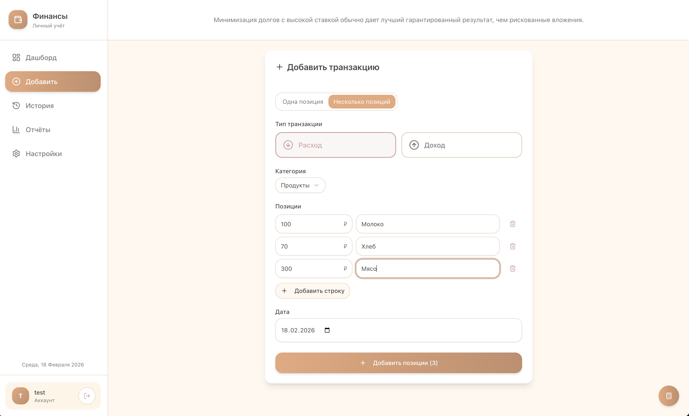
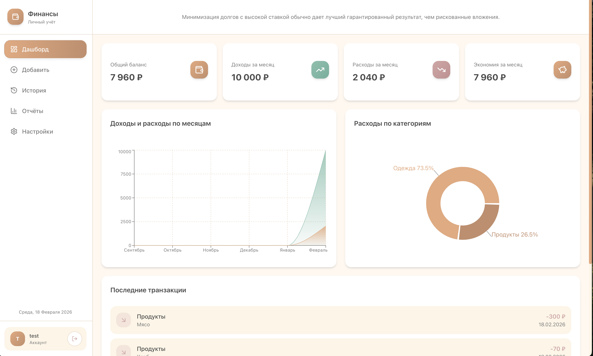
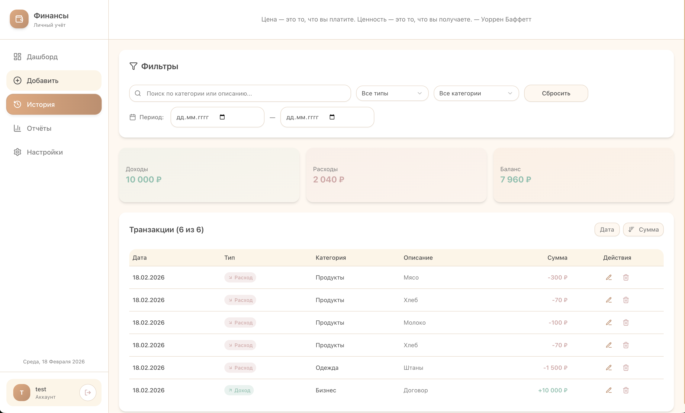
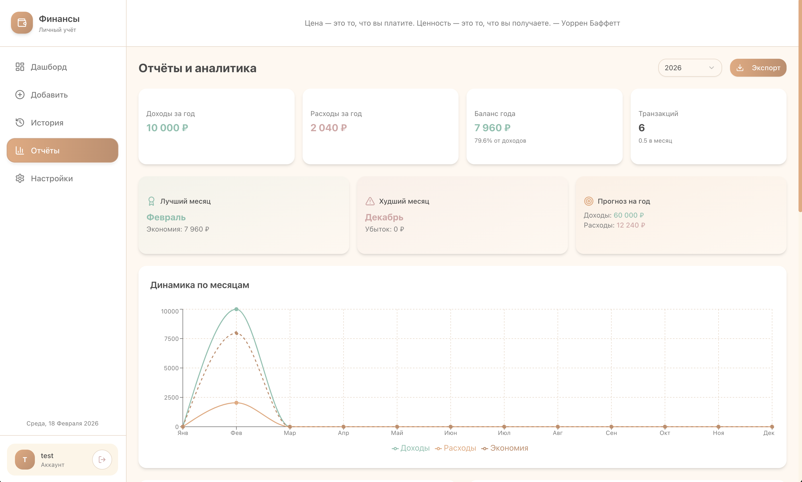

# Финансы - Desktop Application

<p align="center">
  
</p>

Персональное приложение для учета финансов с импортом данных из Excel.

## Скриншоты

| Дашборд | Транзакции |
|---------|------------|
|  |  |

| Лимиты бюджета | Настройки |
|----------------|-----------|
|  |  |

## Функции

- 📊 Дашборд с обзором финансов
- 💰 Управление транзакциями
- 🎯 Лимиты бюджета по категориям
- 🔍 Поиск и фильтрация
- 📥 Импорт из Excel
- 👤 Многопользовательский режим

## Технологии

- Next.js 16, React 19, TypeScript
- Tailwind CSS 4, shadcn/ui
- Zustand (state management)
- Electron (macOS desktop)

## Быстрая сборка DMG

Открой терминал и выполни:

```bash
cd ~/Downloads && rm -rf finance-desktop && git clone https://github.com/nikfani/finance-desktop.git && cd finance-desktop && npm install && cd desktop && npm install && npm run dist:mac
```

Готовый DMG файл: `~/Downloads/finance-desktop/desktop/dist/Финансы-1.0.0-arm64.dmg`

## Разработка (веб-версия)

```bash
cd ~/Downloads
git clone https://github.com/nikfani/finance-desktop.git
cd finance-desktop
npm install
cd desktop && npm install && cd ..
npm run dev
```

Открой http://localhost:3000

## Использование

1. Создайте аккаунт (минимум 3 символа имя, 4 символа пароль)
2. Добавьте категории в Настройках
3. Добавляйте транзакции
4. Импортируйте данные из Excel: Настройки → Данные → Импортировать

### Формат Excel файла

- Лист "Расходы": Дата | Категория | Сумма | Описание
- Лист "Доходы": Дата | Категория | Сумма | Описание

## Структура

```
finance-desktop/
├── src/                    # Next.js приложение
│   ├── app/               # Страницы и API
│   ├── components/        # React компоненты
│   └── store/             # Zustand store
├── desktop/               # Electron
│   ├── electron/          # Main process
│   └── package.json       # Конфигурация
├── screenshots/           # Скриншоты
├── assets/                # Иконки
└── public/                # Статические файлы
```

## Автор

Nik

## Лицензия

MIT
